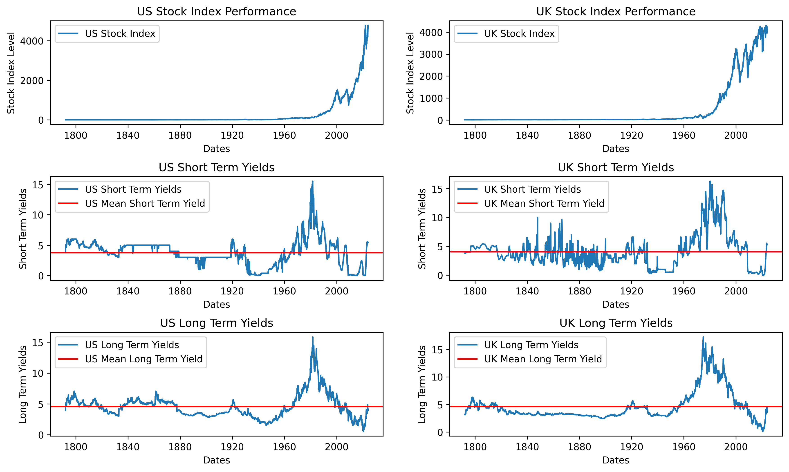
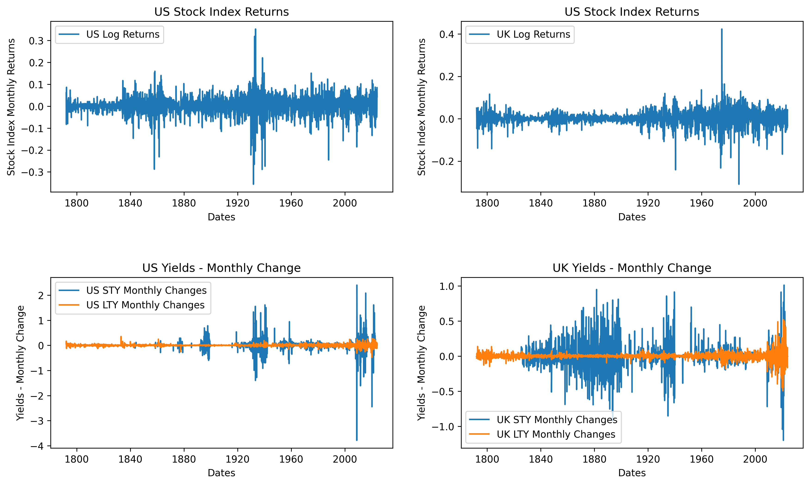
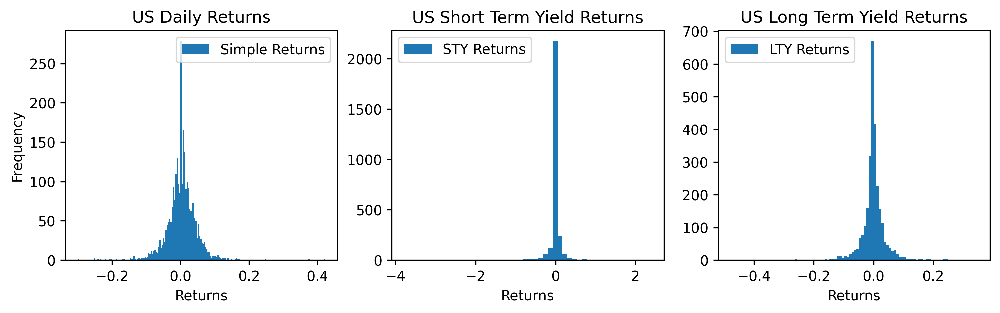
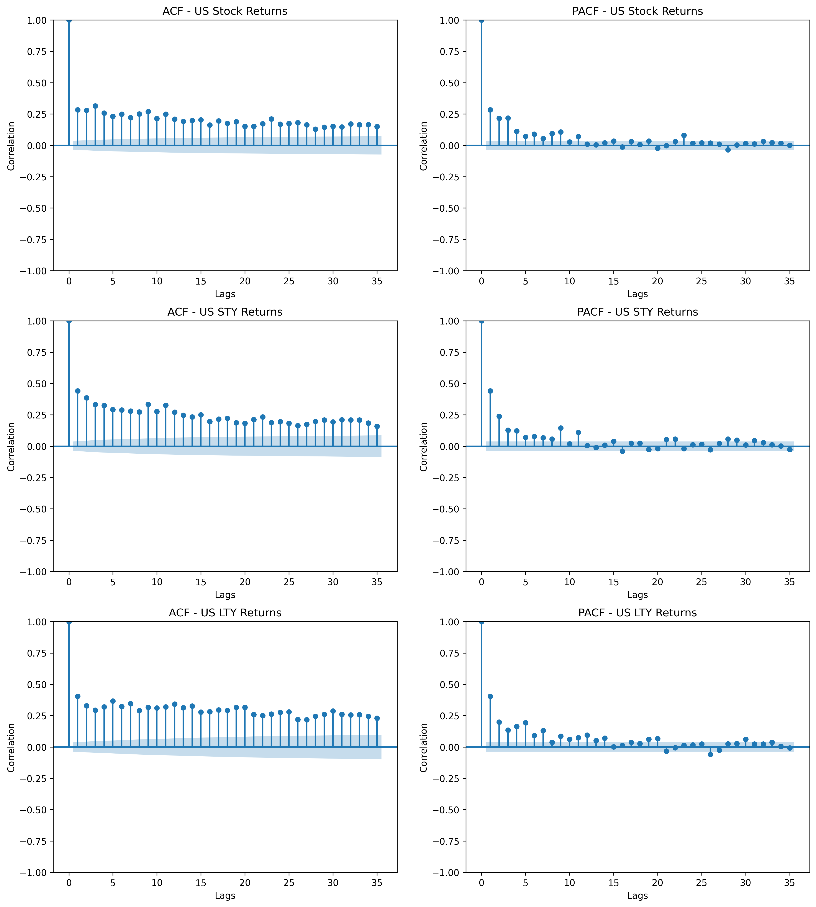
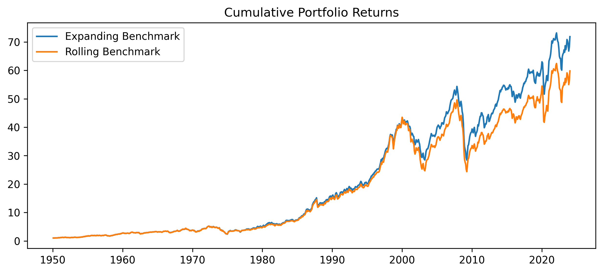

# Imperial College London - Empirical Finance

The First [Coursework](IndividualProject/coursework_1) in this module involved running expanding and rolling window regressions to forecast returns out of sample on US and UK Stock Market Indices. 

### Part 1: Time Series Analysis

In Part 1, we ran statistical analysis and tests to identify the appropriate time series for three asset classes: Stock Indices, Short Term Yield Bonds, and Long Term Yield Bonds. The summary statistics for them can be found here:

The below plots capture the returns/changes in yields for each time series data:

The below plots visualize the distribution of the US assets - each showing their individual skewness and kurtosis. 

 After calculating the summary statistics for each asset, running ACF and PACF tests, conducting stationarity tests and fitting each time series onto appropriate ARMA Models, the following time-series specification was deemed appropriate:
1. US Stock Index: MA(1) Model
2. US Short Term Yields: AR(3) Model
3. US Long Term Yields: ARMA(1,1) Model

Here is plot of the ACF and PACF of all three time series returns:

The code for this part can be found [here.](IndividualProject/coursework_1/q1.ipynb)

### Part 2: Forecasting Returns

The Returns for US and UK Stock Indices were calculated by running a regression of the  one period lagged Term Spread values on the return series:

1. Benchmark Model:
$$y_t = \alpha + \varepsilon_t $$
2. Competing Model:
$$y_t = \alpha + \beta x_{t-1} + \varepsilon_t$$

The Results were evaluated using the MSE between their forecasted returns and the actual returns, the out of sample $R^{2}$, null hypothesis of equal predictability between the Benchmark Model and Competing Model using the Clark and West Test, and the Market Timing Capability of the Model via the Henriksson and Merton Test. 

The code for this part can be found [here.](IndividualProject/coursework_1/q2.ipynb)

### Part 3: Portfolio Optimization for Target Volatility

In this final part of the project, we were tasked with using our return forecasts to build an optimized portfolio targetting a volatility of 10%. We build our covariance matrix with all historical returns up until time t and then add our forecast returns below it. An visual example of this rolling return matrix is below - we then use it at each point in time to build our covariance matrix. 

<table>
<tr><td>USt-120</td><td>UKt-120</td><td>RFRt-120</td></tr>
<tr><td>USt-119</td><td>UKt-119</td><td>RFRt-119</td></tr>
<tr><td>...</td><td>...</td><td>...</td></tr>
<tr><td>USt</td><td>UKt</td><td>RFRt</td></tr>
<tr><td>USt+1</td><td>UKt+1</td><td>RFRt+1</td></tr>
</table>

The Portfolio Variance is then calculate via the formula:

$$ \sigma_p^2 = \mathbf{w}' \mathbf{\Sigma} \mathbf{w} $$

where:
    - \( \mathbf{w} \) is the matrix of portfolio weights
    - \( \mathbf{w}' \) is the transpose of the matrix of portfolio weights
    - \( \mathbf{\Sigma} \) is the covariance matrix of the asset returns
  
The results of each Rolling and Expanding Model can be seen in the plots below:

1. Expanding Window Benchmark Model:

2. Expanding Window Competing Model:

3. Rolling Window Benchmark Model:

4. Rolling Window Competing Model:

### Conclusion:

Overall, none of the models performed well out of sample. For simplicity's sake, the benchmark models were deemed better than the competing models. The Expanding Window Model performed better than the Rolling Window Model. This is show in the cumulative return of both portfolio over time in the plot below:

The Final Report of this project contains a lot more details than this summary. If you care to read it, please click [here!](IndividualProject/coursework_1/EmpricalFinanceIndividualCoursework-TalhaJamal.pdf)
